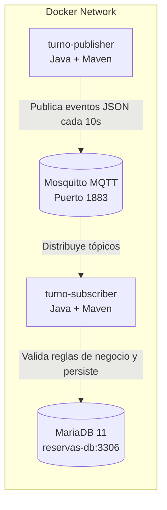
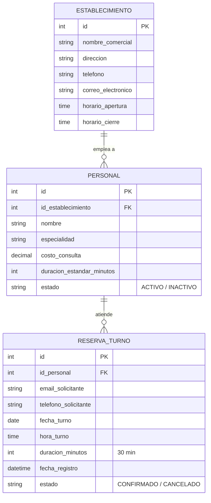

# Trabajo de Taller - Parte 2: Sistema de Reserva de Turnos
**Laboratorio de Ingeniería de Software | UTEC 2026**

Este repositorio contiene la implementación de la **Parte 2** del taller, donde se amplía el prototipo distribuido mediante mensajería **MQTT** utilizando **Java 17**, **Maven**, **Eclipse Mosquitto**, y persistencia en base de datos relacional **MariaDB 11**, todo orquestado y contenerizado con **Docker Compose** en Linux.

---

## 1. Arquitectura de la Solución

El sistema se compone de 4 contenedores interconectados en una red Docker:



### Componentes:
1. **`mosquitto`**: Broker MQTT (Eclipse Mosquitto v2) en el puerto `1883`.
2. **`mariadb`**: Base de datos MariaDB v11 (`reservas-db`), almacena los establecimientos, profesionales y reservas.
3. **`turno-publisher`**: Microservicio en Java que simula clientes generando reservas cada 10 segundos con datos aleatorios pero coherentes con el dominio.
   - **Adaptabilidad a futuras entregas**: Cuenta con el servicio `TurnoPublisherService` con el método `publishTurno(TurnoDTO turno)` desacoplado, listo para ser inyectado y consumido desde una API REST en la siguiente etapa sin modificar la lógica MQTT.
4. **`turno-subscriber`**: Microservicio en Java suscrito al tópico `turnos/reservas`.
   - Inicializa el esquema de tablas y datos semilla de forma automática.
   - Valida las reglas de negocio antes de persistir.
   - Persiste las reservas aprobadas en MariaDB.

---

## 2. Modelo Entidad-Relación (MER)



### Reglas de Negocio Implementadas:
1. **Unicidad de turnos por profesional**: No pueden existir dos turnos para el mismo profesional en el mismo horario (garantizado por código y constraint `UNIQUE KEY (id_personal, fecha_turno, hora_turno)`).
2. **Respeto a la agenda del establecimiento**: Todo turno debe comenzar después del horario de apertura y terminar antes del horario de cierre del establecimiento al que pertenece el profesional.
3. **Profesionales activos únicamente**: Se rechazan solicitudes de turnos para profesionales con estado `INACTIVO`.
4. **Duración estándar**: Todos los turnos tienen una duración fijada de 30 minutos.

---

## 3. Instrucciones de Ejecución

> **Importante**: No se requiere tener instalado Java ni Maven en tu máquina host. La compilación y empaquetado se realizan automáticamente dentro de los contenedores Docker mediante *multi-stage builds* basados en Linux.

### Paso 1: Levantar los contenedores
Desde la carpeta `Parte2`:
```bash
docker compose up --build
```
O en segundo plano (*detached*):
```bash
docker compose up --build -d
```

### Paso 2: Visualizar los eventos en tiempo real
- **En Linux / macOS / Git Bash**:
  ```bash
  ./scripts/ver-eventos.sh
  ```
- **En Windows**:
  ```cmd
  .\scripts\ver-eventos.bat
  ```

En la salida de la consola verás:
- `turno-publish`: Generando y publicando turnos aleatorios cada 10 segundos.
- `turno-subscriber`:
  - `✓ [APROBADO & GUARDADO]`: Reservas que cumplen todas las reglas de negocio y fueron persistidas.
  - `✗ [RECHAZADO]`: Intentos con profesional inactivo, horario fuera de agenda o turno duplicado.

### Paso 3: Consultar los datos en MariaDB
- **En Linux / macOS / Git Bash**:
  ```bash
  ./scripts/ver-turnos-db.sh
  ```
- **En Windows**:
  ```cmd
  .\scripts\ver-turnos-db.bat
  ```

También puedes ingresar interactivamente al cliente MariaDB:
```bash
docker exec -it reservas-db mariadb -u reservas_app -padmin reservas
```
Y ejecutar consultas SQL:
```sql
SELECT * FROM reservas_turnos ORDER BY id DESC;
SELECT * FROM personal;
SELECT * FROM establecimientos;
```

### Paso 4: Detener los contenedores
```bash
docker compose down
```

---

## 4. Estructura del Código Fuente

```text
Parte2/
├── docker-compose.yml              # Orquestación de Mosquitto, MariaDB y los 2 servicios Java
├── README.md                       # Documentación del proyecto
├── scripts/
│   ├── ver-eventos.sh              # Script bash para monitorear eventos en tiempo real
│   ├── ver-eventos.bat             # Script Windows CMD para monitorear eventos
│   ├── ver-turnos-db.sh            # Script bash para consultar datos en MariaDB
│   └── ver-turnos-db.bat           # Script Windows CMD para consultar datos
├── turno-publisher/
│   ├── Dockerfile                  # Multi-stage build (Maven 3.9 + JRE 17 Alpine)
│   ├── pom.xml                     # Configuración Maven y plugins
│   └── src/main/java/com/laboratorio/turnos/publisher/
│       ├── PublisherApp.java       # Punto de entrada principal y scheduler cada 10s
│       ├── generator/
│       │   └── RandomTurnoGenerator.java # Generador aleatorio coherente con el dominio
│       ├── model/
│       │   ├── ReservaMessageDTO.java    # DTO del evento JSON MQTT
│       │   └── TurnoDTO.java             # DTO del turno
│       └── service/
│           └── TurnoPublisherService.java # Servicio desacoplado y reutilizable para API REST
└── turno-subscriber/
    ├── Dockerfile                  # Multi-stage build (Maven 3.9 + JRE 17 Alpine)
    ├── pom.xml                     # Dependencias (Paho MQTT, MariaDB Driver, Jackson)
    └── src/main/java/com/laboratorio/turnos/subscriber/
        ├── SubscriberApp.java      # Punto de entrada principal
        ├── db/
        │   └── DatabaseManager.java       # Conexión JDBC, inicialización DDL y seed data
        ├── model/
        │   ├── ReservaMessageDTO.java     # DTO para deserializar mensaje JSON
        │   └── TurnoDTO.java              # DTO del turno
        ├── mqtt/
        │   └── TurnoMqttSubscriber.java   # Suscriptor MQTT y orquestador del flujo
        ├── repository/
        │   └── ReservaTurnoRepository.java # Operaciones de persistencia en MariaDB
        └── service/
            └── TurnoValidator.java        # Validación de reglas de negocio del dominio
```
